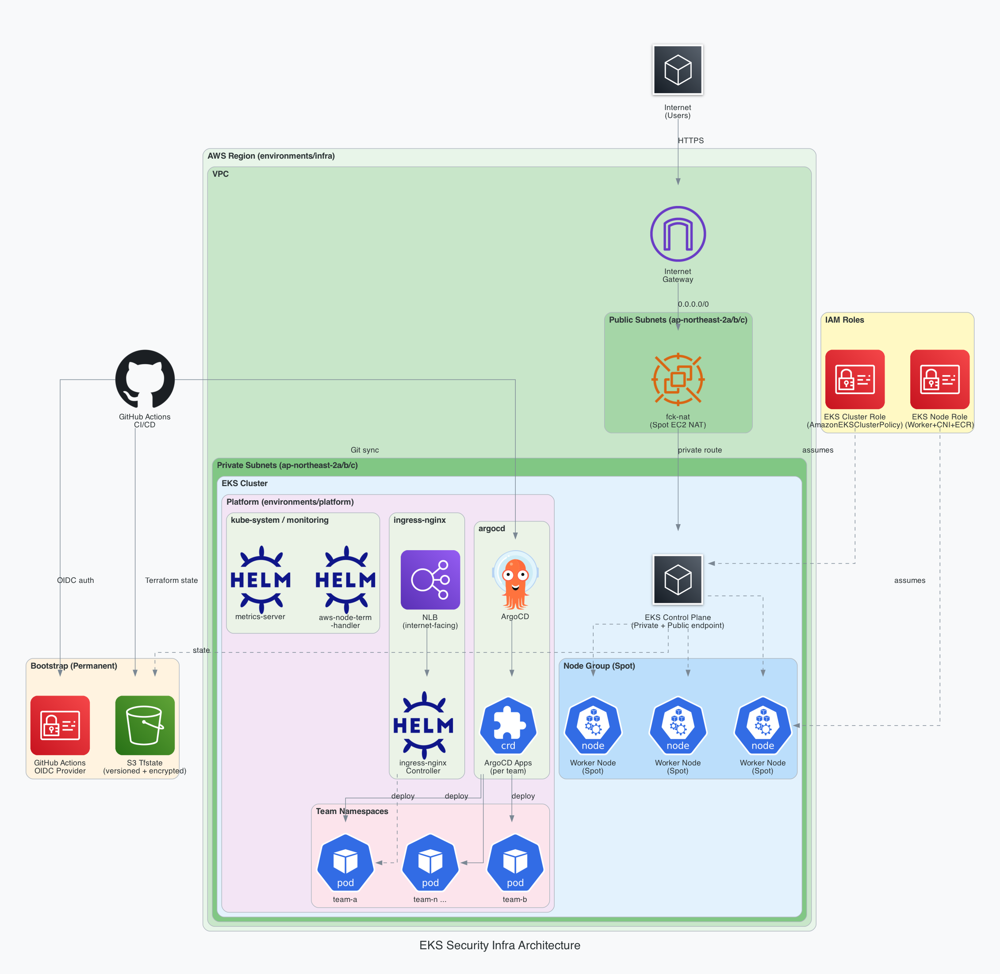

# eks-security-infra

비용 최적화형 EKS 보안 실습 환경을 Terraform과 GitOps 기반으로 구성하기 위한 인프라 레포지토리

## 아키텍처



### 레이어 구성

| 레이어 | 경로 | 설명 |
|---|---|---|
| Bootstrap | `bootstrap/` | Terraform 원격 상태(S3) + GitHub Actions OIDC Provider — 영구 유지 |
| Infra | `environments/infra/` | VPC, fck-nat, EKS 클러스터, IAM Role |
| Platform | `environments/platform/` | Helm 애드온, 팀 네임스페이스, ArgoCD GitOps |

### 주요 컴포넌트

**Bootstrap**
- S3 버킷 — Terraform state 저장 (버전관리 + AES256 암호화, 퍼블릭 액세스 차단)
- IAM OIDC Provider — GitHub Actions 무비밀키 인증

**Infra (AWS)**
- VPC — 퍼블릭/프라이빗 서브넷 멀티 AZ 구성
- Internet Gateway — 퍼블릭 서브넷 인터넷 연결
- fck-nat — Spot EC2 기반 비용 최적화형 NAT (Managed NAT Gateway 대비 ~90% 비용 절감)
- EKS Control Plane — private + public endpoint, 프라이빗 서브넷 배치
- Node Group — Spot 인스턴스, gp3 암호화 볼륨, IMDSv2 강제 적용
- IAM Role — EKS Cluster Role / Node Role (최소 권한 원칙)

**Platform (Kubernetes)**
- Metrics Server — 리소스 사용량 수집 (HPA 기반)
- AWS Node Termination Handler — Spot 중단 이벤트 사전 대응 (드레인 처리)
- Ingress NGINX — internet-facing NLB 연동 인그레스 컨트롤러
- ArgoCD — GitOps 기반 지속 배포 엔진
- ArgoCD Apps — 팀별 Application 자동 생성 (팀 레포 → 팀 네임스페이스 동기화)
- Team Namespaces — 팀별 격리 네임스페이스 (`training.k8rvis.io/team` 라벨)

### 실행 순서

```
bootstrap → infra → platform
```

## 추천 작업 순서
1. 이슈 생성
2. 라벨 및 프로젝트 지정
3. 작업 상황 업데이트 및 시작일, 마감일 작성
4. 브랜치 생성
5. 작업 진행
6. PR 생성 후 리뷰 요청

## 저장소 구조
- `bootstrap/`: Terraform 원격 상태 저장소와 장기 유지형 인증 기반을 생성하는 영구 스택
- `environments/infra/`: VPC, NAT, EKS 같은 AWS 인프라 계층 루트 스택
- `environments/platform/`: Helm/Kubernetes 기반 공통 애드온과 클러스터 내부 리소스 계층 루트 스택
- `modules/`: VPC, EKS, 애드온, ArgoCD, namespace 정책을 단계적으로 쌓는 재사용 모듈
- `manifests/`: 샘플 워크로드와 팀별 GitOps 매니페스트
- `scripts/`: 클러스터 생성, 삭제, kubeconfig 설정 자동화 스크립트

## 생명주기 원칙
- `bootstrap`은 장기 유지하는 영구 인프라다.
- `environments/infra`는 AWS 인프라 계층을 관리한다.
- `environments/platform`은 클러스터 내부 플랫폼 계층을 관리한다.
- 실행 순서는 `bootstrap -> infra -> platform`을 기본으로 한다.

## 협업 규칙

### 이슈 작성 흐름
1. 작업을 시작하기 전에 먼저 이슈를 만든다.
2. 이슈 템플릿은 작업 성격에 맞게 `Feature request`, `Task`, `Bug report` 중 하나를 선택한다.
3. 보안 성숙도 모델 작업 시 각 항목에 맞는 `area:*` 라벨과 `priority:*` 라벨을 붙인다.
4. 브랜치는 이슈 번호를 포함해서 생성한다.

### 이슈 라벨 규칙

라벨 색상은 같은 카테고리끼리 통일한다.
- `type:*`: 파란 계열
- `area:*`: 초록 계열
- `priority:*`: 주황/빨강 계열

#### 타입 라벨
- `type:feature`: 새로운 기능이나 사용자 가치가 있는 변경
- `type:task`: 구현 준비, 리팩터링, 설정, 운영 작업
- `type:bug`: 동작 오류, 배포 실패, 환경 불일치 수정
- `type:docs`: 문서 작성 또는 수정
- `type:chore`: 유지보수성 작업, 의존성 업데이트, 잡무성 변경

#### 영역 라벨
- 해당 영역은 산출물의 "보안 영역"이 지정되면 추가한다.

#### 우선순위 라벨
- 해당 영역은 산출물의 "우선순위"가 지정되면 추가한다.

## 이슈 템플릿
- `Feature request`: 새로운 모듈, 기능, 실습 흐름, GitOps 구성을 제안할 때 사용
- `Task`: 구현 단계별 작업, 리팩터링, 문서 정리, 운영 작업을 나눌 때 사용
- `Bug report`: Terraform apply 실패, 리소스 생성 오류, 잘못된 권한 설정, 배포 실패 같은 문제를 기록할 때 사용

## 브랜치 네이밍 규칙

### 기본 형식
`<kind>/issue-<번호>-<짧은설명>`

### 브랜치 종류
- `feat/`: 새로운 기능 구현
- `task/`: 일반 작업, 구조 정리, 설정 추가
- `fix/`: 버그 수정
- `docs/`: 문서 전용 변경
- `chore/`: 유지보수, 의존성, 관리성 작업

### 네이밍 규칙
- 설명은 소문자 영어 kebab-case를 사용한다.
- 가능하면 이슈 번호를 반드시 포함한다.
- 설명은 짧고 작업 범위가 드러나야 한다.
- 하나의 브랜치에는 하나의 이슈만 다루는 것을 기본으로 한다.

### 예시
- `task/issue-1-bootstrap-repo-skeleton`
- `feat/issue-7-vpc-private-subnet-layout`
- `feat/issue-12-eks-spot-node-group`
- `fix/issue-18-argocd-sync-timeout`
- `docs/issue-3-readme-collaboration-guide`
